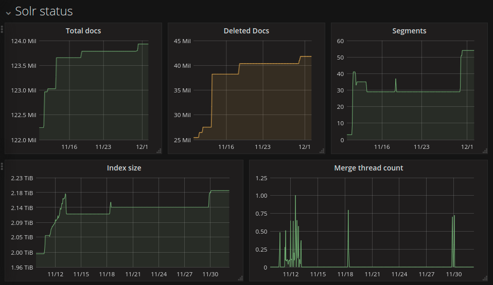

# solr-status

A simple [collectd](https://collectd.org) plugin written in [Go](https://golang.org) that gathers metrics from an [Apache Solr](https://solr.apache.org) instance. 


*Some graphs made with Grafana using data collected by this plugin.*

## Why ?
I needed a simple way to export few metrics from a standalone Solr instance. I was already using collectd, InfluxDB & Grafana, so I wrote this plugin to export the data and be able to build some nice graphs with it.

## Install & use
  - Build the binary and copy it to a viable directory (e.g `/usr/lib/collectd/plugins/solr-status`)
  - Add an entry in the `collectd` config file to call the plugin. This would work:

```apacheconf
# Replace "solr.server.com" with your Solr's FQDN or ip address, and "MyIndex" with your index name. 
# Optionally you can enforce HTTPS by adding the "--https" parameter.

LoadPlugin exec
<Plugin exec>
    Exec "collectd-plugin" "/usr/lib/collectd/plugins/solr-status" "--server" "solr.server.com" "--core" "MyIndex"
</Plugin>
```

## License
BSD 3-Clause License